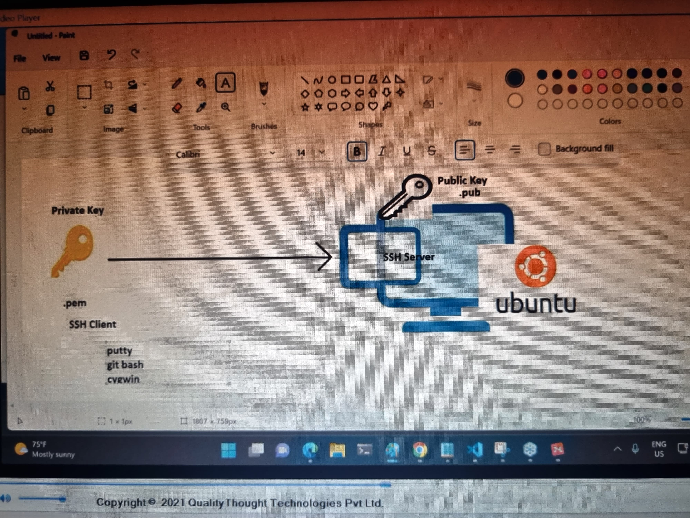
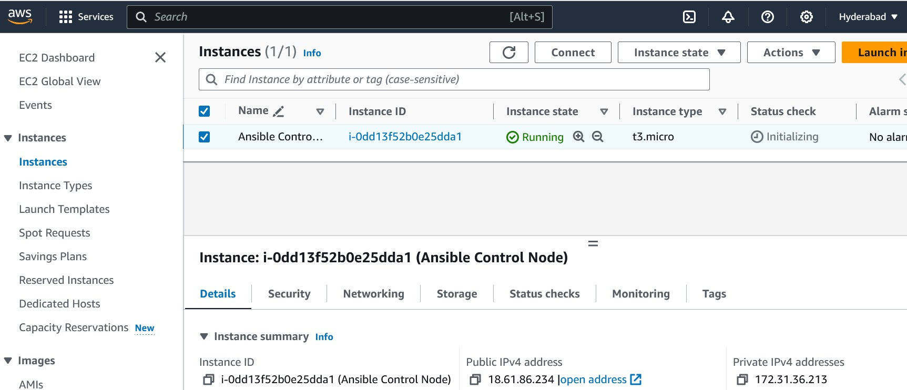
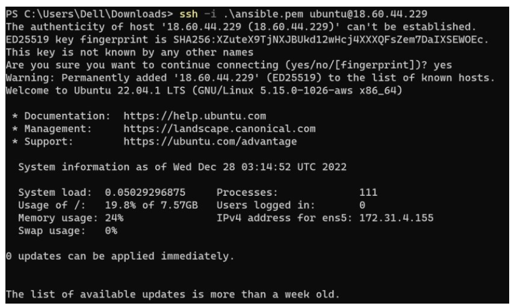
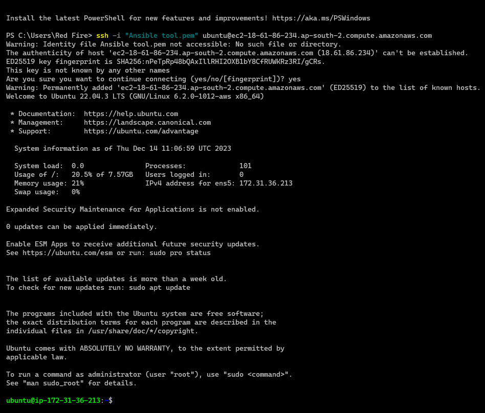
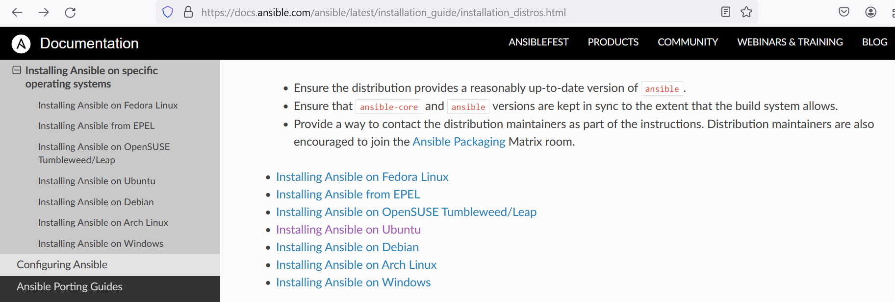
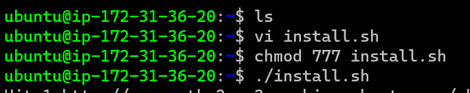
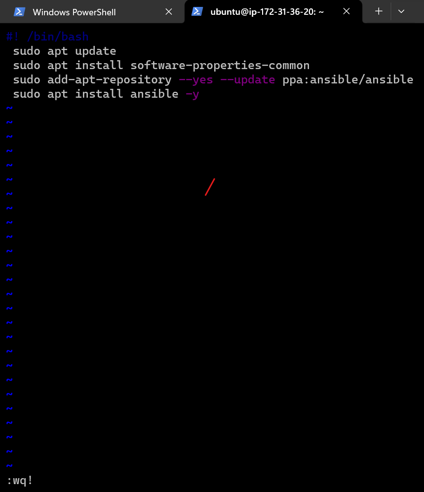
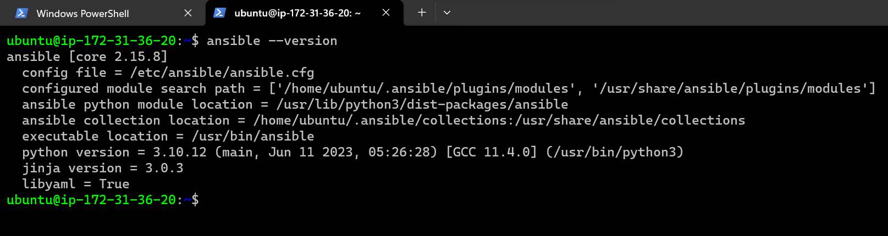

##                28
## What needs to provided to Ansible 

* Desired State: 
       * The Desired state is written in YAML and is called as `Playbook`.
    
* List of Nodes:
       *    The nodes where the playbook has to be executed, this is referred as `inventory` .
   
* Credentials:
       *       * Credentials can be passed as part of `playbook/inventory/  commandline` . 

## Setup of Ansible

* If a user wants to login any Linux operating system. There is 2 ways
*   1= Username and Password (`Key Based Authentication`) so in this `Key Based Authentication` we have 2 ways a) Public key b) Private key (``Symmetric vs. Asymmetric Encryption=?``) 
*   2= 

* ## Ansible Control Node
     * This component takes the inputs mentioned above to execute playbooks on the nodes.
     * This Node is a linux vm or physical machine and we install ansible.
* ## Credentials:
     * Username 
     * Password
     * Key Based Approach  
* public key is stored as .pub and private key is stored as .pem
* 
*    
* 
* ## Lab Setup: 
* ##  AWS (UBUNTU):-
* 
* 
* 
* ## Ansible Setup: 
* Refer Here: https://docs.ansible.com/ansible/latest/installation_guide/installation_distros.html
* 
* 
* ## Installing Ansible  
* Always use offical documents and latest one. 
* you can install this command 1 by 1
*  ``$ sudo apt update``
   `` $ sudo apt install software-properties-common``
   `` $ sudo add-apt-repository --yes --update ppa:ansible/ansible``
   ``$ sudo apt install ansible`` 
* if you dont want to do again and again copy paste commands so we have one more option. we can do through via `vi` using bash command line
* ex:- `vi install.sh` enter press `i` then write 
*      `#! /bin/bash`
* copy  from docs and paste here or write all command
*  ``$ sudo apt update``
   `` $ sudo apt install software-properties-common``
   `` $ sudo add-apt-repository --yes --update ppa:ansible/ansible``
   ``$ sudo apt install ansible`` 
   then press `Esc` then `:wq!`
   give chmod permission 
   `chmod 777 install.sh`
   `./install.sh`
* 
* 
* 
* check ansible is install or not into your system
* `ansible --version`
* Note:
Installing Necessary Softwares on your System. Refer here:- https://www.youtube.com/watch?v=9guzVbZPGuw&t=701s
------------------------------------------------------------------------------
            