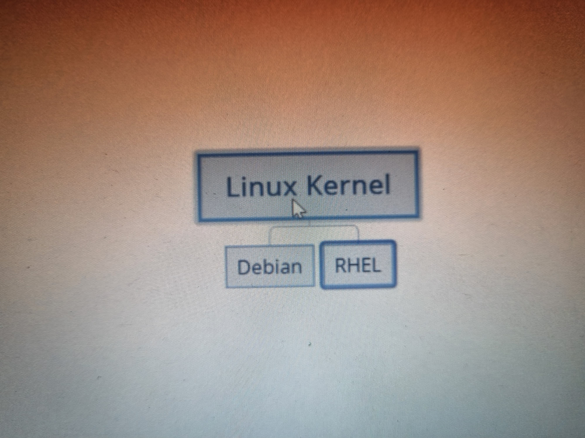

##                28
## What needs to provided to Ansible 

* Desired State: 
       * The Desired state is written in YAML and is called as `Playbook`.
    
* List of Nodes:
       *    The nodes where the playbook has to be executed, this is referred as `inventory` .
   
* Credentials:
       *       * Credentials can be passed as part of `playbook/inventory/  commandline` . 

## Setup of Ansible

* ## Ansible Control Node
     * This component takes the inputs mentioned above to execute playbooks on the nodes.
     * This Node is a linux vm or physical machine and we install ansible.
* ## Credentials:
     * Username 
     * Password
     * Key Based Approach  
     
* Lab Setup: 
* AWS (UBUNTU) :
  
            