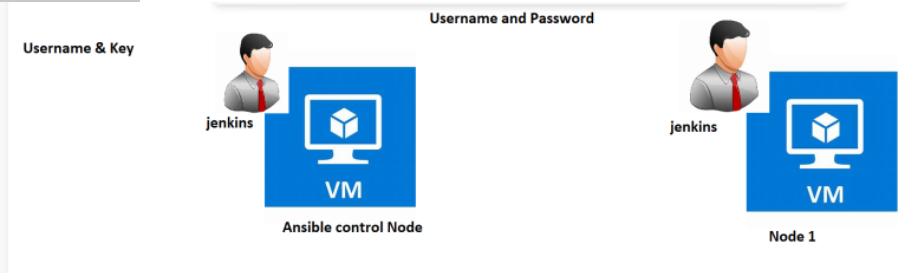
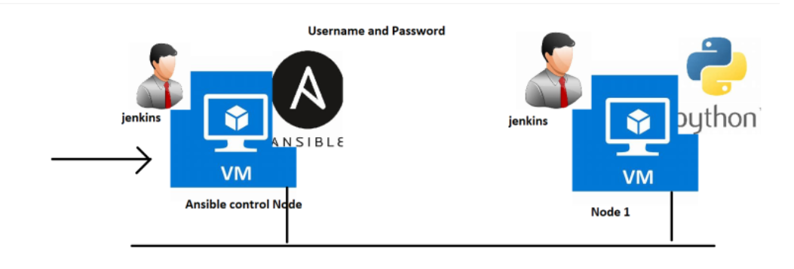
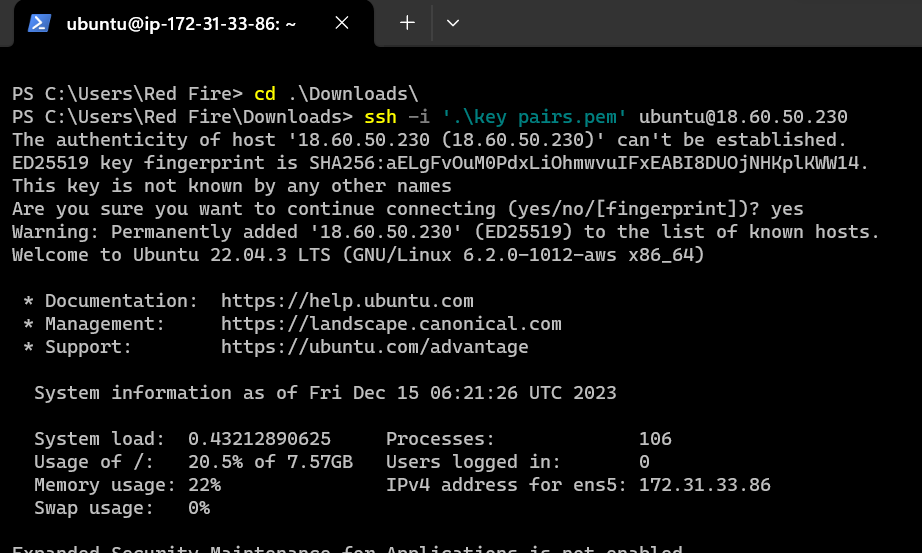
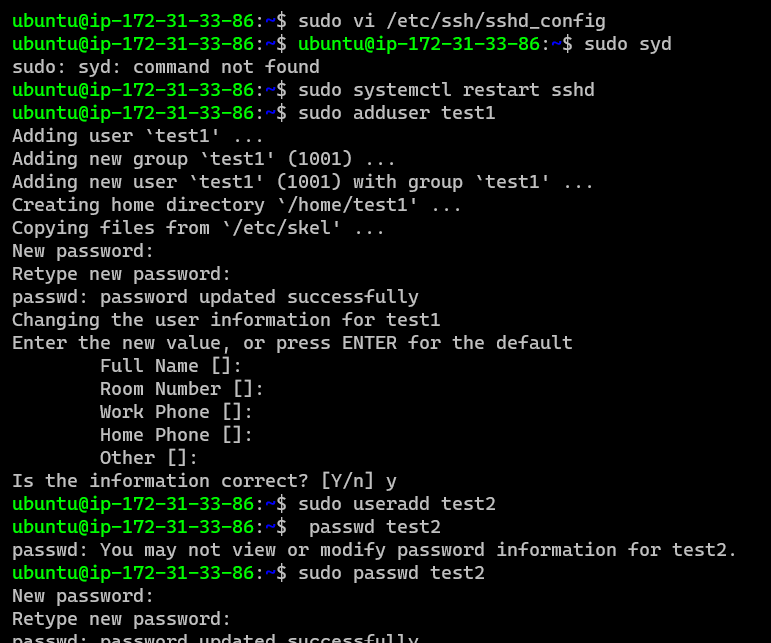

* ## Installing Ansible
* Ansible can be installed in two ways
          * Package Managers
          * Python:https://docs.ansible.com/ansible/latest/installation_guide/intro_installation.html#installing-and-upgrading-ansible
* ## Python based installation
* `python3 --version`
  `pip3 --version`
  `python3 -m pip install --user ansible`
## Ansible deals with credentials
* Possible Credentials
       * Username and Password
       * Username and key
* Ansible when executing playbook logins to the node using credentials provided and takes help of the python installed on the node to get the job done.
* Login into the node
       * SSH: This is used for linux and mac
       * Winrm: This is used for windows
* ## Username and Password Authentication
* ## Overview

* Linux machines allow us to login using ssh protocol and configurations of ssh are present in 
* ## to know the how many users are present in the machine `cat /etc/passwd`
* The field __PasswordAuthentication__ should be __yes__.
* ``sudo vi /etc/ssh/sshd_config`
# Change PasswordAuthentication to yes
  ``sudo systemctl restart sshd``   
* Create a user called as jenkins 
* to create user 
  ```
  * sudo useradd <username>
to set user password or change `sudo passwd <username>` aftr this you can set the password
* sudo adduser <username> 
 this will directly ask you to set password.
`sudo adduser jenkins`
`su jenkins` su= switch-user and jenkins= username 
* to delete user `sudo userdel <username>` 
  ```





* Lets make jenkins administrator
* `sudo visudo`
* 
* Lets ask not to prompt for password for jenkins user

* Do the same stuff for node 2 
*  