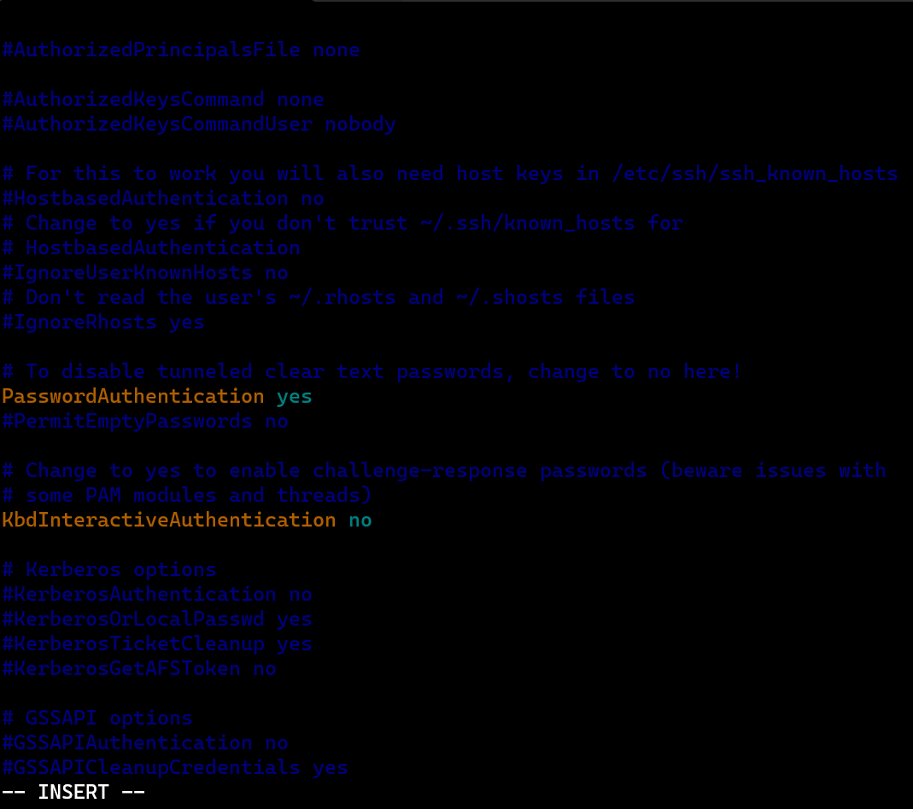

## Installing Ansible (ansible --help)
* Ansible can be installed in two ways
          * Package Managers
          * Python:https://docs.ansible.com/ansible/latest/installation_guide/intro_installation.html#installing-and-upgrading-ansible
## Python based installation
* `python3 --version`
  `pip3 --version`
  `python3 -m pip install --user ansible`
## Ansible deals with credentials
* Possible Credentials
       * Username and Password
       * Username and key
* Ansible when executing playbook logins to the node using credentials provided and takes help of the python installed on the node to get the job done.
* Login into the node
       * SSH: This is used for linux and mac
       * Winrm: This is used for windows
* ## Username and Password Authentication
* ## Overview

* Linux machines allow us to login using ssh protocol and configurations of ssh are present in 
## to know the how many users are present in the machine `cat /etc/passwd`
* The field __PasswordAuthentication__ should be __yes__.
* In `vi editor` you can search also though `/PasswordAuthentication` it will show you same line. it will save your time.
* It means---> ``sudo vi /etc/ssh/sshd_config`` __Enabling Password based Authentication__
 ``sudo vi /etc/ssh/sshd_config`
* Change __PasswordAuthentication__ to __yes__
  ``sudo systemctl restart sshd`` or  ``sudo service sshd restart`` 
  
    
  
  
  !
* Create a user called as test1 

* For creating user we have 2 commands and that is given below
<1>
   `` sudo useradd <username>`` 
   ``sudo adduser test1``
   ``sudo passwd test1``
* To set user password or change `sudo passwd <username>` aftr this you can set the password.
* sudo adduser <username>  it will ask you to set password.
 this will directly ask you to set password.
<2>
* Create a user called as jenkins
  ``sudo adduser jenkins``
  `su jenkins` su= switch-user and jenkins= username 
* to delete user we use 
* ``sudo userdel <username>`` 
 
* Lets make ``jenkins`` administrator
* `sudo visudo`
* 
* 
* Lets ask not to prompt for password for jenkins user
* 
* You can now able to login into your system throug username also 
  ``ssh jenkins@18.60.50.230`` 
    ssh username@ip-address 
   
* ## Do the same stuff for node 2 
* `.\ it means current folder/directory`
* 
* 
* public ip is to connect with external address 
* if your 2 machines are in same network so we should use private ip
* Once you restart your machine public ip changes every time . If you restart your machine 10 times so it would change 10 public ip but __private ip is constent or it will same ip__ that's why we always use private ip for internal communications.
* __Now we are going to connect Ansible control node to node1__ 
*  
* 
* If the username is same 2 or 3 or both machines so give only ip address. ex. ssh 172.31.39.203 it connect after giving it user password.
* 
* In `vi inventory`  paste other machine private ip in vi editor
* ``ansible -i inventory -m ping all``
* ``ansible -i inventory -k -m ping all``
*  it means i am asking to the ansible to check whatever machine is present in that inventory file can you connect with them or not.
* This is Ansible ping. (ansible --help) no need to learn command just write in terminal it show you every command Ansible related.
* 
--------------***************************--------------------------------------