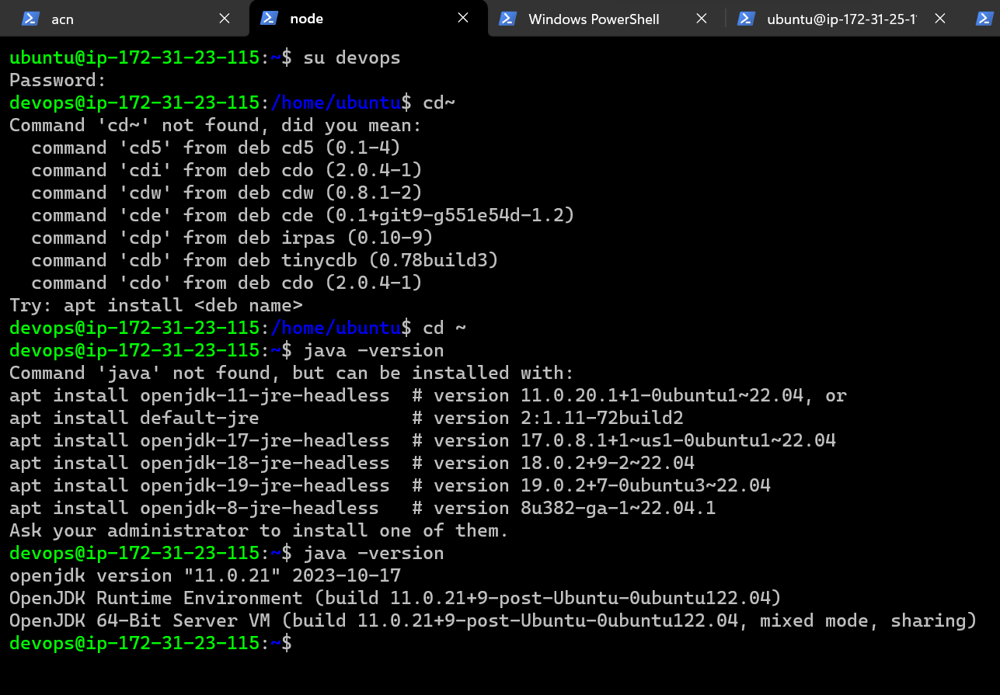
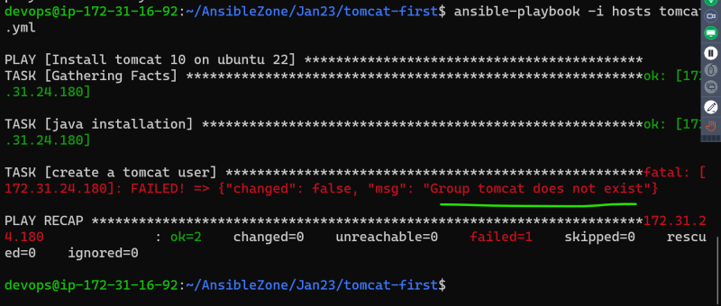
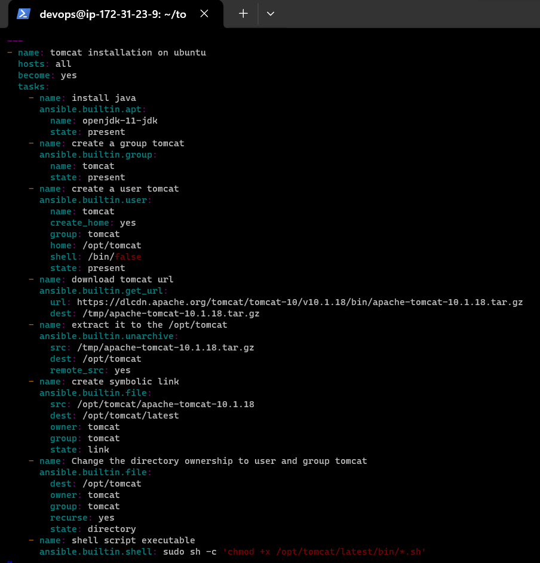

__Ansible Contd….__
* Lets try to install tomcat 10 on ubuntu 22.04 ReferHere: https://linuxize.com/post/how-to-install-tomcat-10-on-ubuntu-22-04/
* Ansible WOW (Ways of Working)
       * Ensure your manual steps are working
       * For each steps try to find a module which can help expressing desired state. 
* __Manual Steps__
 
```
sudo apt update
sudo apt-cache search openjdk
sudo apt install openjdk-11-jdk -y
java -version
* __Creating a System User__
sudo useradd -m -U -d /opt/tomcat -s /bin/false tomcat
VERSION=10.1.17
wget https://dlcdn.apache.org/tomcat/tomcat-10/v10.1.17/bin/apache-tomcat-10.1.17.tar.gz -P /tmp
* Once the Tomcat tar file is downloaded, extract it to the /opt/tomcat directory:
sudo tar -xf /tmp/apache-tomcat-${VERSION}.tar.gz -C /opt/tomcat/
sudo ln -s /opt/tomcat/apache-tomcat-${VERSION} /opt/tomcat/latest
sudo chown -R tomcat: /opt/tomcat
* The shell scripts inside the Tomcat’s bin directory must be executable in order to run:
sudo sh -c 'chmod +x /opt/tomcat/latest/bin/*.sh'
* These scripts are used to start, stop and otherwise manage the Tomcat instance.
__Creating SystemD Unit File__
*Open your text editor and create a tomcat.service unit file in the /etc/systemd/system/ directory:
sudo nano /etc/systemd/system/tomcat.service
* Paste the following configuration:

```
``
[Unit]
Description=Tomcat 10 servlet container
After=network.target

[Service]
Type=forking

User=tomcat
Group=tomcat

Environment="JAVA_HOME=/usr/lib/jvm/java-11-openjdk-amd64"
Environment="JAVA_OPTS=-Djava.security.egd=file:///dev/urandom -Djava.awt.headless=true"

Environment="CATALINA_BASE=/opt/tomcat/latest"
Environment="CATALINA_HOME=/opt/tomcat/latest"
Environment="CATALINA_PID=/opt/tomcat/latest/temp/tomcat.pid"
Environment="CATALINA_OPTS=-Xms512M -Xmx1024M -server -XX:+UseParallelGC"

ExecStart=/opt/tomcat/latest/bin/startup.sh
ExecStop=/opt/tomcat/latest/bin/shutdown.sh

[Install]
WantedBy=multi-user.target
```
* Modify the JAVA_HOME variable if the path to your Java installation is different.
* Save and close the file and run the following command to notify systemd that we created a new unit file:

sudo systemctl daemon-reload
* Enable and start the Tomcat service:
sudo systemctl enable --now tomcat
* Check the service status:
sudo systemctl status tomcat
* The output should show that the Tomcat server is enabled and running:

```
● tomcat.service - Tomcat 10 servlet container
     Loaded: loaded (/etc/systemd/system/tomcat.service; enabled; vendor preset: enabled)
     Active: active (running) since Sat 2022-12-24 18:53:37 UTC; 6s ago
    Process: 5124 ExecStart=/opt/tomcat/latest/bin/startup.sh (code=exited, status=0/SUCCESS)
   Main PID: 5131 (java)
...

* You can start, stop, and restart Tomcat the same as any other systemd service:
  
```
sudo systemctl restart tomcat
sudo systemctl stop tomcat
sudo systemctl restart tomcat

```


## Now for web interface follow the docs Refer:https://linuxize.com/post/how-to-install-tomcat-10-on-ubuntu-22-04/


 __Manual steps is completed here__

 ## Ansible Playbook to automate the above steps
__note: don't do oneshot installtion at a time , do one by one / in steps 1 after 1.__
* create 2 instance then give
* This is Ansible Control Node:--> `sudo vi /etc/ssh/sshd_config, sudo systemctl restart sshd, sudo useradd devops,  sudo visudo, install ansible on (Ansible control node), ssh-keygen, ssh-copy-id devop@ip address of node,` now check via `ssh 172-31-38-192 (ip address of node)`. 
* Create an inventory with one entry i.e. node private ip `echo 172-31-38-192 > inventory` here echo node's ipaddress > inventory. 
* This is Node:--> `sudo vi /etc/ssh/sshd_config, sudo systemctl restart sshd, sudo useradd devops,  sudo visudo,`.
  
* 1st step install java on host server
* `su devops` create 1 directory `mkdir tomcat, cd tomcat, vi tomcat.yml and vi hosts` 
* 
* 
* 
* 
* To enable verbose logging of ansible `-v to -vvvv` it will gives you more details about project 
* if u want to understand what Ansible is doing so increase your verbose level via `-v to -vvvvv` .
* Now we are supposed to create a user called tomcat
       * with home directory in /opt/tomcat
       * with shell /bin/false
       * with group tomcat (same as username)     
* Module in ansible for useradd Refer:https://docs.ansible.com/ansible/latest/collections/ansible/builtin/user_module.html
* we will continue.....

* Lets try to install tomcat 10 on ubuntu 22.04 refer:https://linuxize.com/post/how-to-install-tomcat-10-on-ubuntu-22-04/
* On execution of the playbook we got an issue with tomcat group not present
* 
* refer here: for the changes to fix the group not existing and rerun the playbook
* 
* 
* to check group or user is created or not `cat /etc/group or for user cat /etc/passwd`
* 
* download tomcat 10.1.17 now `VERSION=10.1.17` and paste there link https://dlcdn.apache.org/tomcat/tomcat-10/v10.1.17/bin/apache-tomcat-10.1.17.tar.gz
* 
* 
* to go the `node1` and check in `/tmp` folder is it present or not.
* 
* Once the Tomcat tar file is downloaded, extract it to the /opt/tomcat directory and we are replacing the extra download step and use remote src in unarchiveremove extra step
* 
* 
* 
* it is visible now in node1
* 
* 
* the changes made to change ownership and create the symbolic link and we’ll create a symbolic link named latest, that will point to the Tomcat installation directory:
*  __`__recurse set only when the state is directory__`__
* 
* 
* 
* for setting recursive permissions on the folder.
* 
* 
* 
* to know `sh` files for that `ls *.sh` command
* The next step to be automated is `__sudo sh -c 'chmod +x /opt/tomcat/latest/bin/*.sh'__` . Here there are approximately 12 files in 10.1.17 version to be changed.
* 
* ansible -m ping all that is `ad hoc` command
*  when  you use commmand or shell module the problem with that is it run every time when you run ansible playbook which is not a good thing, idealy we should avoiding those kind of things.
*  For automating above lets use `ansible.builtin.shell or command `, these module are not idempotent i.e. it gets executed every time when ansible playbook is executed (this should be last resort). This needs to be fixed but for now lets use the command directly. 
* 
*  __ask__?
* 
* Iam getting error via automating till above picture. 
* but when i do manually then its execute via manually see the below picture.
*  __ask__?
* for the changes to fix the shell file permissions.
* __The above problem is resolved via recreate instance, takes tomcat v10.1.18 and resolved__.
* 
* 
* 
* if your file is in local system and you want to copy on remote server then use `__src__` but if the file is present in remote server and you want to copy on remote server then use `__remote_src__`
* now Creating SystemD Unit File..
* We need to copy tomcat.service file from ansible control node to remote nodes. Refer Here: https://docs.ansible.com/ansible/latest/collections/ansible/builtin/copy_module.html for the module used .
* Now we need to reload the daemon, enable and start the service
*  node1
  
* Now access tomcat (Ensure 8080 port is opened in security groups)
* 
* 
* 
* Ansible playbook which we have written works only for ubuntu, we need to extend this to work for other linux distributions.
* If we need to make this playbook work for future versions of tomcat it will not as we have hardcoded 10.1.18
* If we want extend this playbook to install any version of java
* 


  


