## Ansible Setup with Key Based Authentication between ACN and Node
* ```ansible -i inventory -m ping all``` here `i = inventory and -m = module `
* Overview
* Create two linux vm’s
* 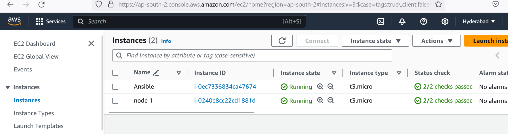
* Create a user on both vms with password
* 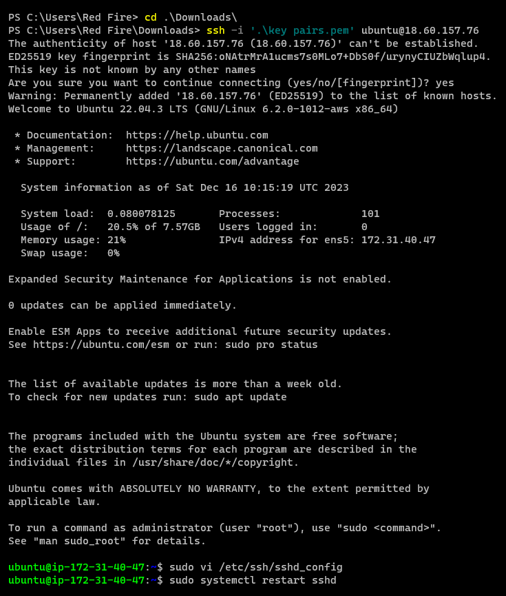
* 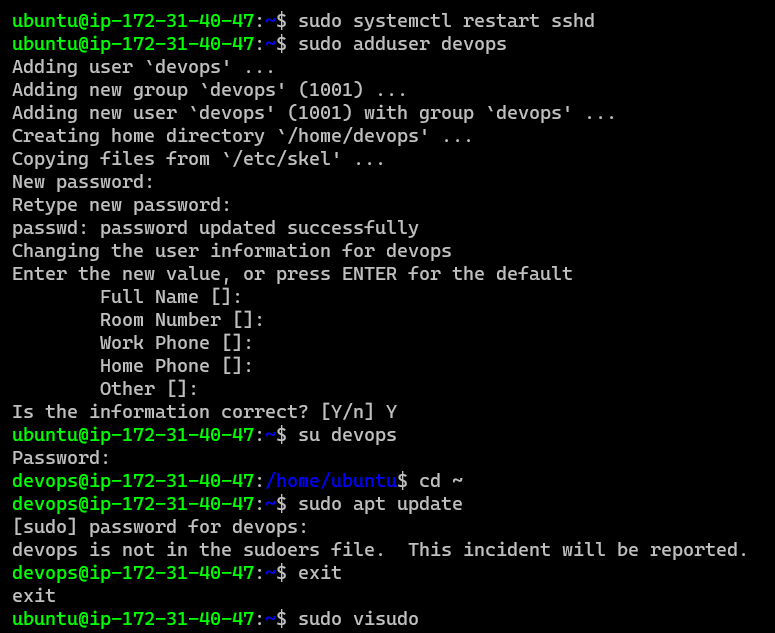
* 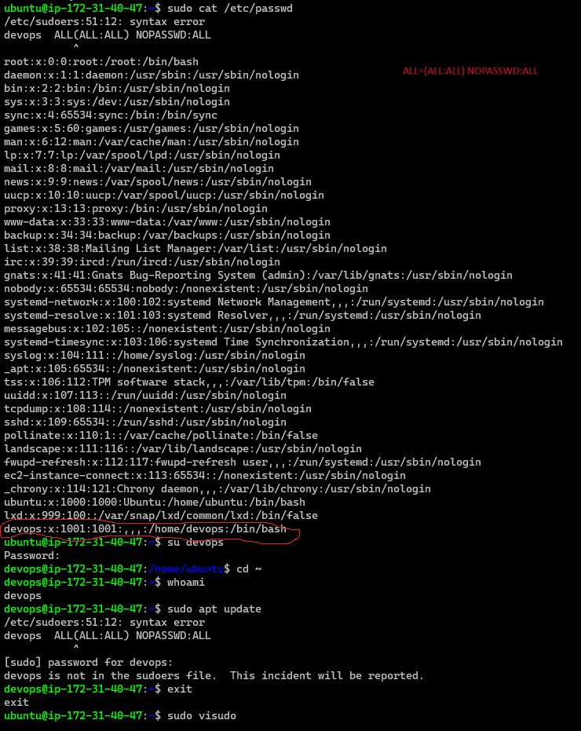
* Ensure the user has sudo permissions
* 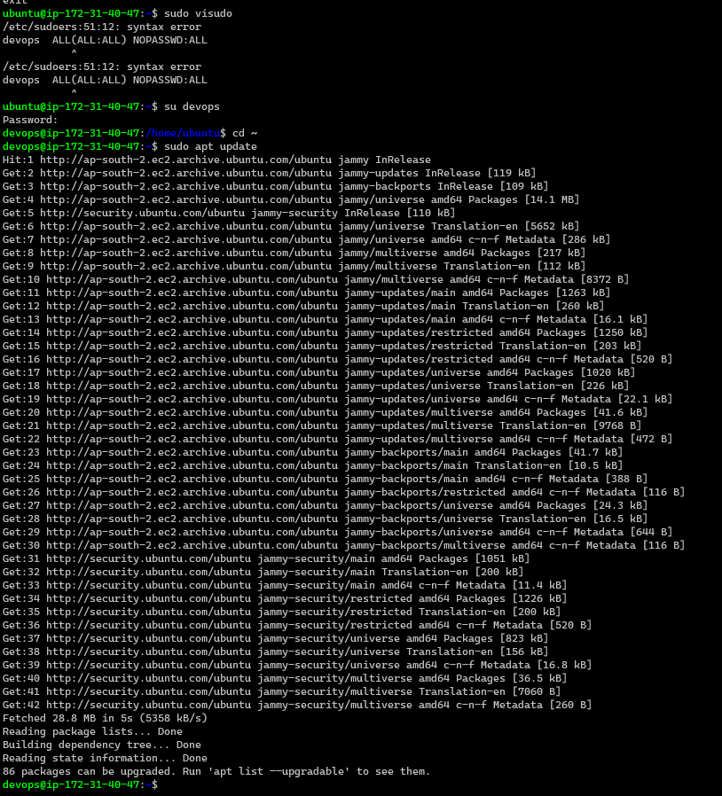
* Now create an ssh key pair on Ansible control node
* 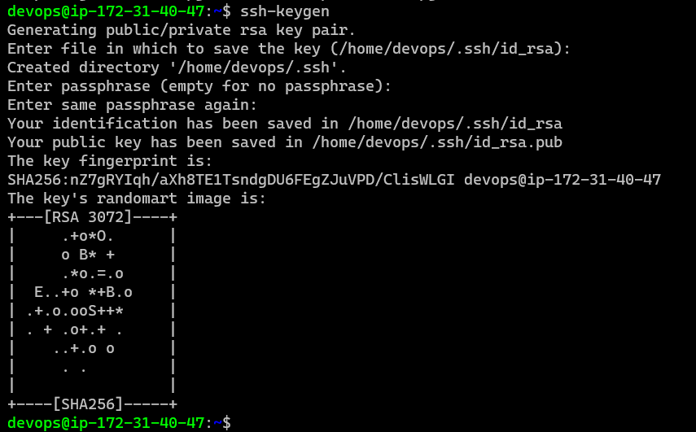
* Copy the public key from Ansible control node to node 
* 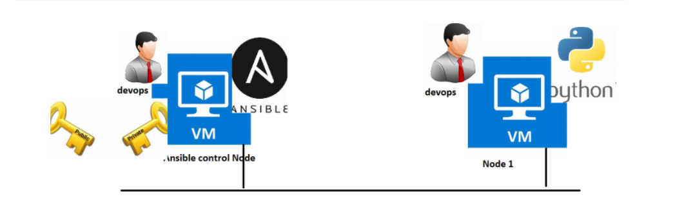
* 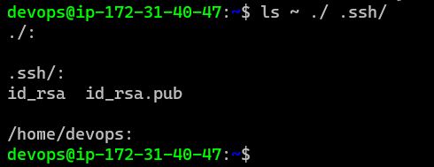 `id_rsa` is a private file and  `id_rsa.pub` is public file.
* If both machine in the same network so prefer private ip.
*  ## ssh-copy-id :-  
                    ``ssh-copy-id`` installs an SSH key on a server as an authorized key. Its purpose is to provide access without requiring a password for each login. This facilitates automated, passwordless logins and single sign-on using the SSH protocol
* __So once you copy the key the advantage of this is we no longer need password__.
* 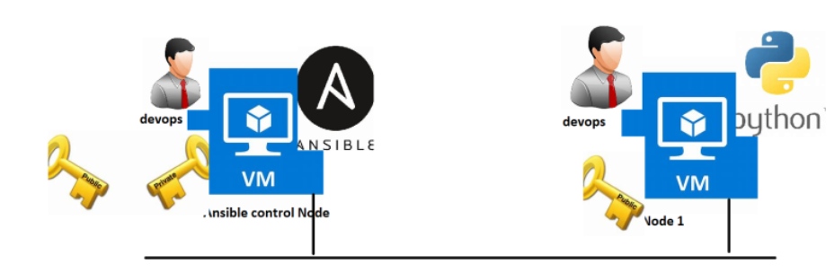
* 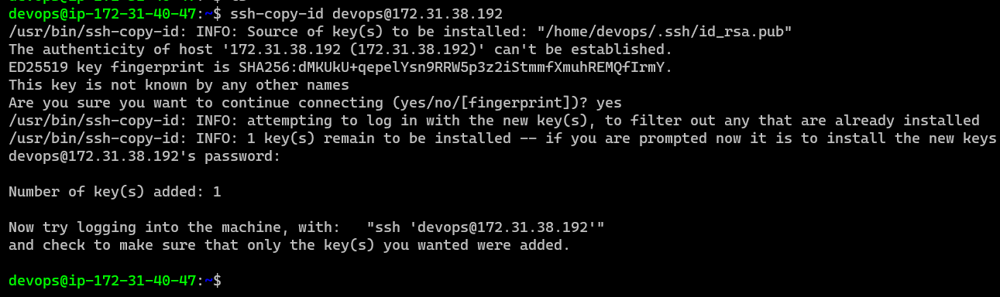
* Its not going to ask you to enter password now. We are not using username here (ssh 172-31-38-192) because both username is same that's why we are using private ip here.
* __Try login from ansible control node to node without password__
* 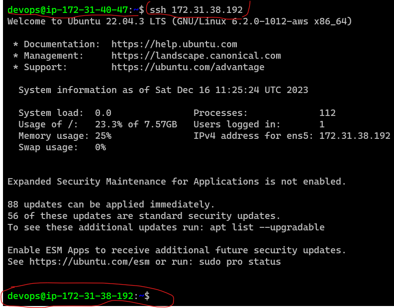 
* Username is matching. I have given the private ip address and when i give that ip address it will automatically take id_rsa as a default key file. For that id_rsa there should be a matching public key,  That matching public key we have a already copied by using ssh-copy-id for that reason its working. 
* ## Install ansible
* 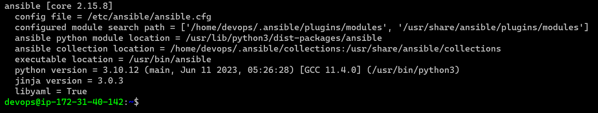
* Create an inventory with one entry i.e. node private ip
* 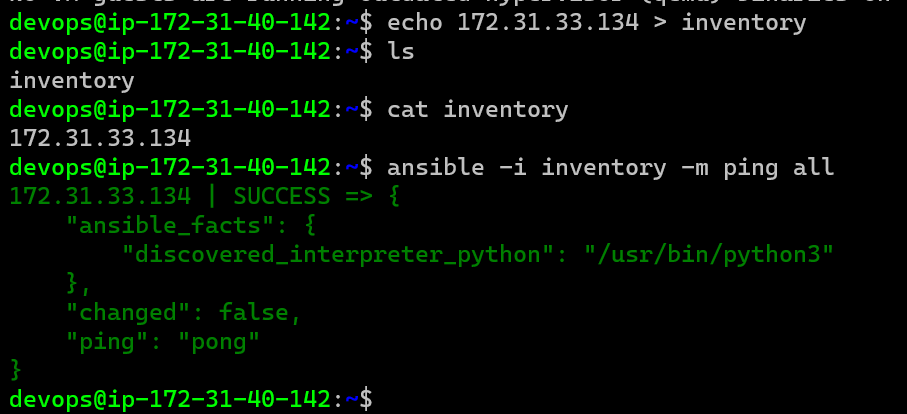
* 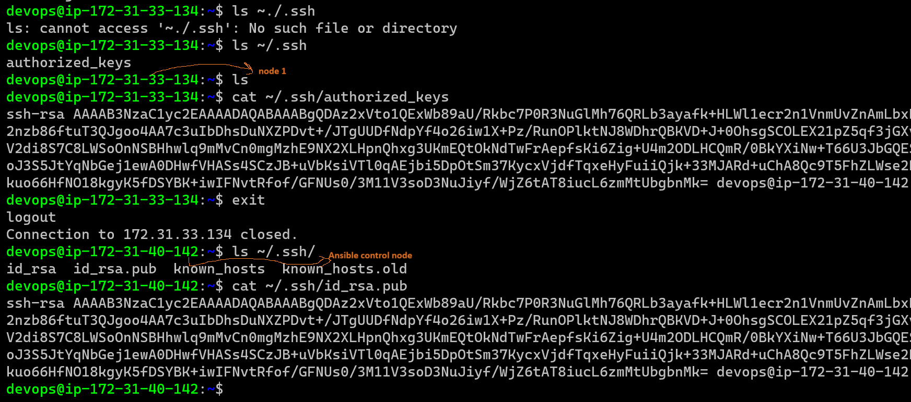 both key file is same
* ## Lets Have fun with some manual activities 
* `yum and service command is a module `
* playbook is a collection of place. 
* play will tell you where you want to run this, which user do u want to executed and what are the collection and what are the collection of modules want to run.
* so this collection of module consider as task.   
*  Installing apache server and creating an extra html page.
*  ubuntu: 
*  for manual steps: https://www.geeksforgeeks.org/how-to-install-apache-server-in-ubuntu/
*  `sudo apt update`
   `sudo apt install apache2 -y`
* ## Ways of Work in Ansible (First Version)
* In Ansible work organization is as shown below
* 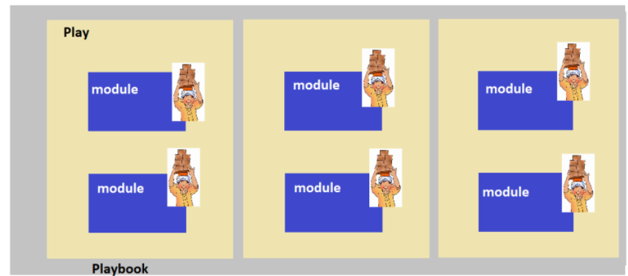
* We create playbooks in YAML format which is collection of plays.
* Each Play will have 
      * where the play has to be executed
      * Which user should be executing the work
      * List of modules to perform your automation where we describe the desired state
* Ensure you have valid manual steps (which are working)
* For each manual step find out an equivalent module
* for YAML and Json Tutorial:https://youtube.com/watch?v=ggOmHlnhPaM&list=PLuVH8Jaq3mLuqXuGs6aeqxhuvCYSzB1kT&index=6

------------------------------------------------------------------------------------------------------------------ 