## YAML

* It is a Data Description Format.
* It is widely used to store. 
       * Data
       * Confugrations
 
* Data can be categorized into 2 types 
 
       (1) Simple/Scalar: 
          * Text `name: Ansible`
          * Number `version: 2.13`
          * Boolean `Opensource: yes`    
          
       (2) Complex 
       * list/array (Plural) 
            “`yaml
         colors:</li>
         <li>red</li>
         <li>blue</li>
         <li>green
         “`

       * Object/map/directory
        
       `yaml`

       `address`

       `flatno: 407`

       `building: ramnivas`

      `city: Hyderabad`

* JSON/YAML use KEY-VALUE (Name Value) pairs.
* YAML Basic key value syntax is `key: value`
* Sample YAML ( QUALITY THOUGHT)
 
 ```
 ---
name: QualityThought
contact:
  email:
    - support@qualitythought.in
    - qualitythought.in@gmail.com
  phone:
    - 888888888
    - 999999999
  address:
    - flat: 407 
      building: mythrivanam
      city: hyderabad
    - flat: 307
      building: nilgiri
      city: Hydrebad
```

## Good books to read

```
---
Purpose: Good Books to read
Books: 
  - Title: Your Brain at Work 
    Author: David Rock
    ISBN: 978-0062312822
    Language: English
  - Title: Rich Dad Poor Dad
    Author: Robert Kiyosaki
    ISBN: 978-1612680194
    Language: English
  - Title: Who moved my cheese
    Author: Spencer Johnson
    ISBN: 978-0091883768
    Language: English
```

* Write a yaml describing your favorite movies/holiday destinations

 ```
 ---
 movies:
   - name:
     starcast:
       - 
       -
     technical:
       director:
       producer:
     release: 
   - 
   -

 destinations:
   - name:
     modeoftransport: 
     spots:
       -
       -
       -
```
 
* YAML files are generally stored with extensions .yaml or .yml
 
## Ansible Playbook
   * for official docs: https://docs.ansible.com/ansible/2.8/user_guide/playbooks_intro.html
   * The structure of the YAML is defined by Ansible```
```
---
- name: <purpose>
  hosts: <where to execute>
  become: <yes or no> # whether to run task with sudo 
  tasks: 
    - name: <task description> # individual step
      <module-name>: 
         <param-1>: <value-1>
         <param-n>: <value-n>
    - name: <task description>
      <module-name>: 
        <param-1>: <value-1>
        <param-n>: <value-n>
        state: <desired-state> 
```

## Lets write a playbook for Apache installation

* Manual steps

```
sudo apt update
sudo apt install apache2 -y

```

(1) 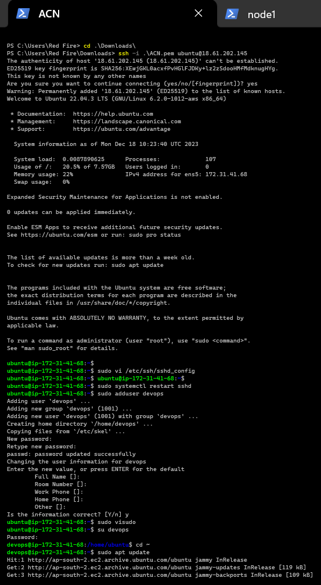

(2) 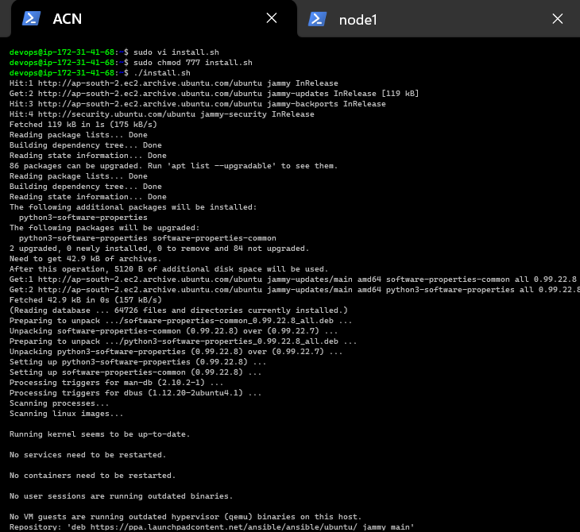

(3) 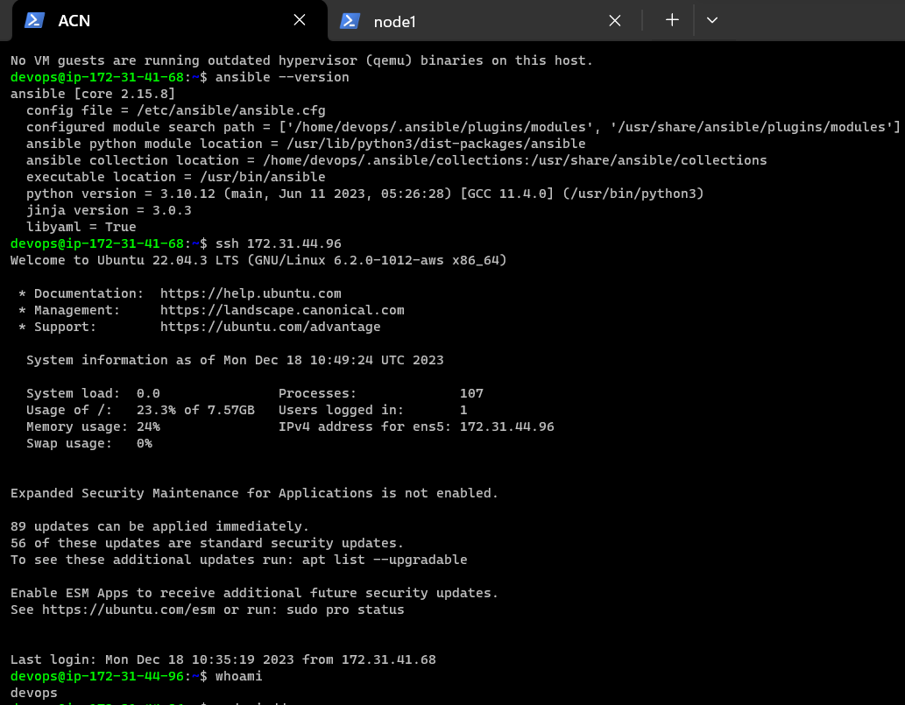

(4) 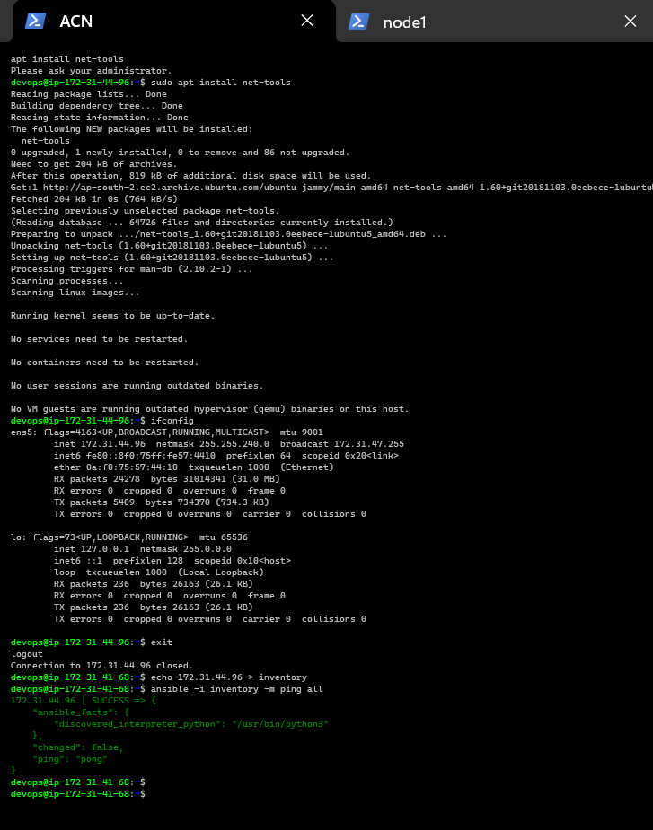

(5) 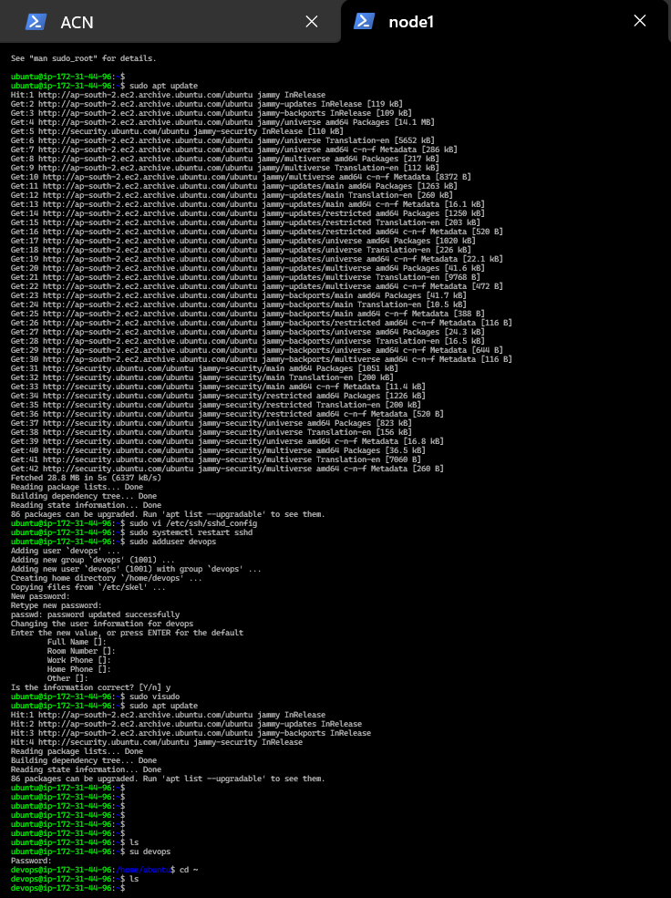

* Google `apt in ansible` for the module page: https://docs.ansible.com/ansible/latest/collections/ansible/builtin/apt_module.html
* Go through parameters and fill in the necessary parameters
* Playbook:https://github.com/asquarezone/AnsibleZone/commit/2dbc83aba6c9b9b59d9025dfc345c2e13ae0f012  for the changes done
* Executing ansible playbook: https://docs.ansible.com/ansible/latest/cli/ansible-playbook.html
* __Lets try to install apche2 server on ubuntu (hosts server)__
* Now in Ansible control Node (ACN) create folder called `apache-file`
  `mkdir apache-file` `cd apache-file` `vi apache-install.yaml` write playbook in .yaml and then `vi hosts` put __hosts ip address means node1,2or node3 etc__
  (6) 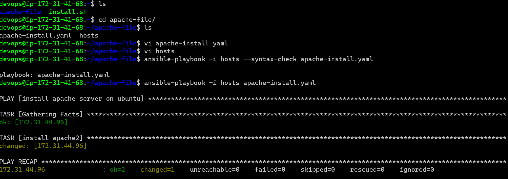
* (7) 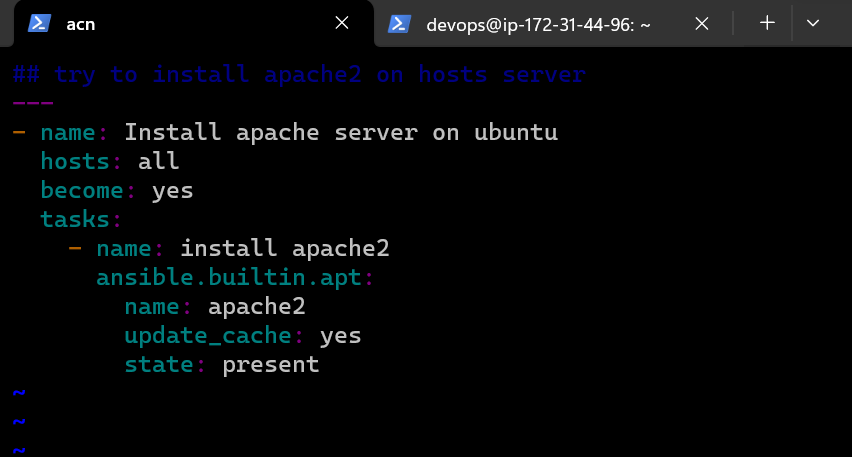
* (8) 
* (9) 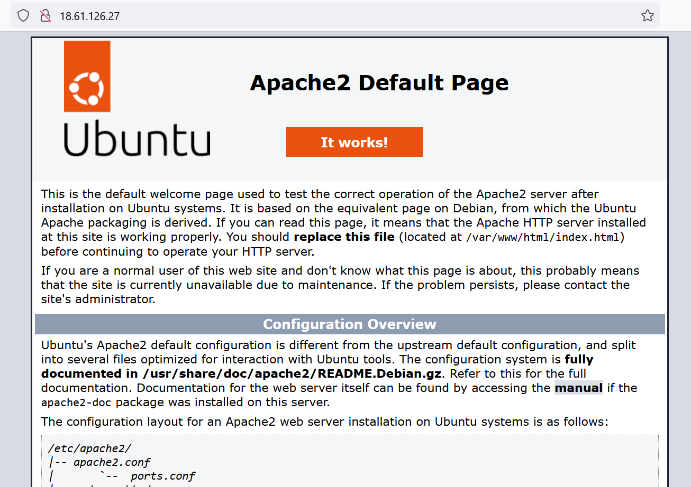
* you can delete that installed software via `sudo apt-get/ apt purge apache2` __software name after purfe__
* (10) 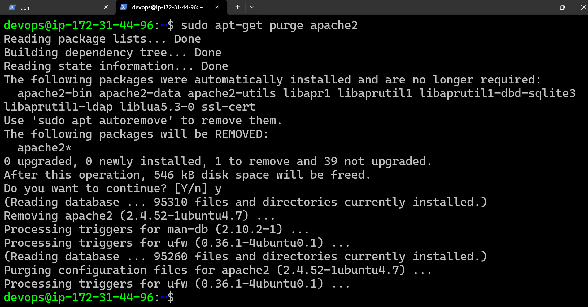
* Now re-execute the same command and ansible will not install apache2 but since apache2 exists it doesn’t change  any thing
* Now install ngnix
* 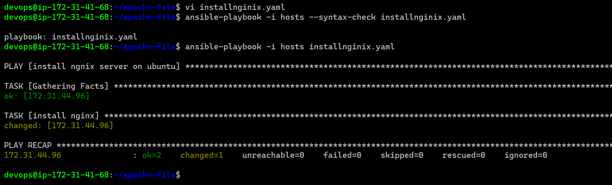
* 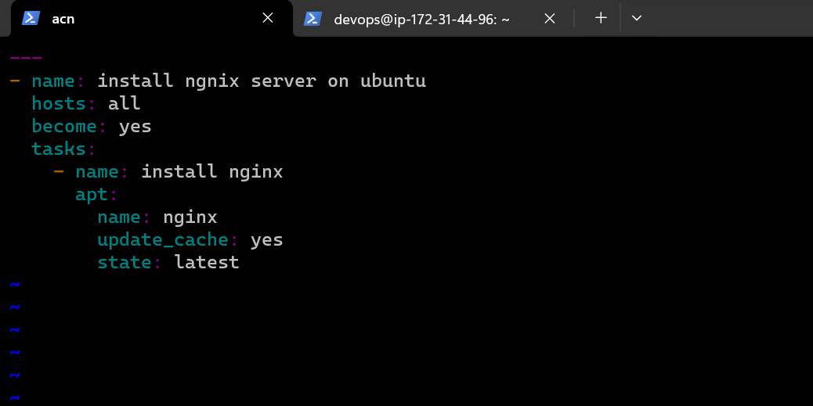
* (11) 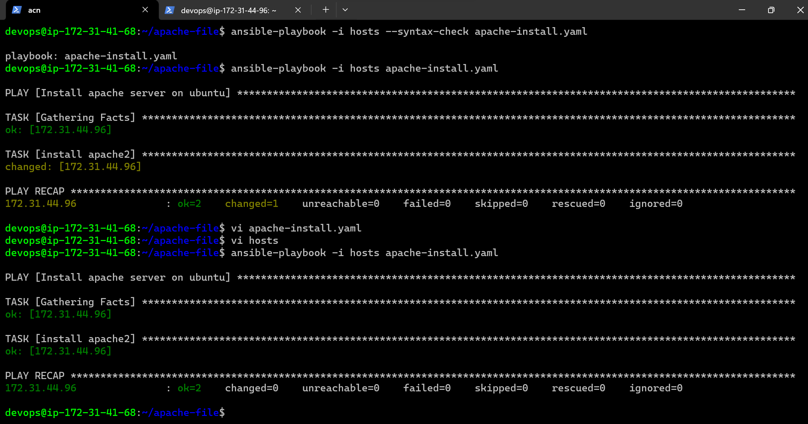
* In YAML `true or yes` and `false or no`  is a same thing.
* Before `-` you have to give `2 space` and After `-` you have to give `1 space` .
* You can write multiple playbook in one file by entering `---` below every playbook. 
* __Yellow means Ansible has done somework in server `changed=1`__
___________________________________________________________________________________________________________________          