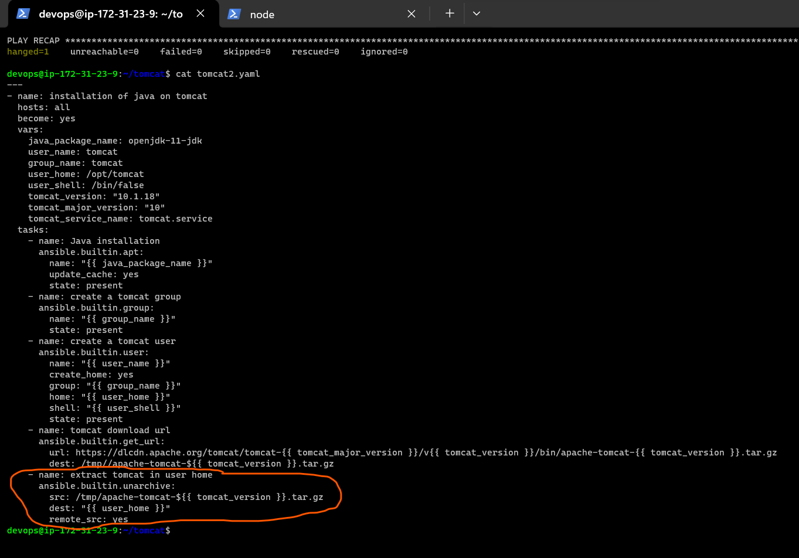

## Ansible continue
* __variable means jo change hoga future me yaha meri soch hai pura directory change ho sakta hai (variables means what can change)__
* __use ctrl+F3 for select same words in vscode__
* __for redhat ` sudo visudo ` in section of same thing without password is ` devops ALL=(ALL) NOPASSWD:ALL `__
* verboose? when you want to print this value
* refer here: https://docs.ansible.com/ansible/latest/cli/ansible-playbook.html
* When we execute ansible playbook on the node where everything is installed, changes shouldn’t happen. But as of now there are changes during every execution done by ansible.
* Context xml with same contents is created as two files and two times the copy is handled in two tasks in last class/notes.
* Ansible playbook which we have written works only for ubuntu, we need to extend this to work for other linux distributions.
* If we need to make this playbook work for future versions of tomcat it will not as we have hardcoded 10.1.18
* If we want extend this playbook to install any version of java
  
## Variables in Ansible

* Ansible uses variables to manage differences between systems. With Ansible, you can execute tasks and playbooks on multiple different systems with a single command.
* To represent the variations among those different systems, you can create variables with standard YAML syntax, including lists and dictionaries. 
* refer here: https://docs.ansible.com/ansible/latest/playbook_guide/playbooks_variables.html#using-variables
* Lets create a simple playbook
```
 ---
 - name: checking variable demo
   vars: 
     name: anil
   hosts: all
   tasks:
     - name: print variable value
       debug: 
         var: name
     - name: print something else
       debug: 
         var: "hello, {{ name }}"
```
 


-------------------------------------------------------------------------------------------------------------------
### doing with vars now:- __plz dont use tomcat2.service, use tomcat.service__ wherever i used tomcat2.service you use tomcat.service 

* Lets introduce the variables for tomcat playbook: 
* till create a tomcat user 
* 
* 
* 
*  tomcat url: 
* 
* 
* Once the Tomcat tar file is downloaded, extract it to the /opt/tomcat directory:
* 
* 
* create a symbolic link 
* 
* Change the directory ownership to user and group tomcat:
* 
* The shell scripts inside the Tomcat’s bin directory must be executable in order to run:
* 
* Creating SystemD Unit File 
* 
* 
* sudo systemctl daemon-reload
* Enable and start the Tomcat service:
* sudo systemctl enable --now tomcat
* Check the service status:
* sudo systemctl status tomcat
* 
* 
* 
```
devops@ip-172-31-23-9:~/tomcat$ cat tomcat2.yaml
---
- name: installation of java on tomcat
  hosts: all
  become: yes
  vars:
    java_package_name: openjdk-11-jdk
    user_name: tomcat
    group_name: tomcat
    user_home: /opt/tomcat
    user_shell: /bin/false
    tomcat_version: "10.1.18"
    tomcat_major_version: "10"
    tomcat_service_name: tomcat.service
  tasks:
    - name: Java installation
      ansible.builtin.apt:
        name: "{{ java_package_name }}"
        update_cache: yes
        state: present
    - name: create a tomcat group
      ansible.builtin.group:
        name: "{{ group_name }}"
        state: present
    - name: create a tomcat user
      ansible.builtin.user:
        name: "{{ user_name }}"
        create_home: yes
        group: "{{ group_name }}"
        home: "{{ user_home }}"
        shell: "{{ user_shell }}"
        state: present
    - name: tomcat download url
      ansible.builtin.get_url:
        url: https://dlcdn.apache.org/tomcat/tomcat-{{ tomcat_major_version }}/v{{ tomcat_version }}/bin/apache-tomcat-{{ tomcat_version }}.tar.gz
        dest: /tmp//apache-tomcat-${{ tomcat_version }}.tar.gz
    - name: extract tomcat in user home
      ansible.builtin.unarchive:
        src: /tmp/apache-tomcat-${{ tomcat_version }}.tar.gz
        dest: "{{ user_home }}"
        remote_src: yes
    - name: create symbolic link
      ansible.builtin.file:
        src: "{{ user_home }}/apache-tomcat-{{ tomcat_version }}"
        group: "{{ group_name }}"
        owner: "{{ user_name }}"
        dest: /opt/tomcat/latest
        state: link
    - name: Change the ownership
      ansible.builtin.file:
        group: "{{ group_name }}"
        owner: "{{ user_name }}"
        dest: "{{ user_home }}"
        recurse: yes
        state: directory
    - name: Tomcat bin directory must be executable
      ansible.builtin.shell: "sudo sh -c 'chmod +x {{ user_home }}/latest/bin/*.sh'"
    - name: Creating SystemD Unit File
      ansible.builtin.copy:
        dest: /etc/systemd/system/tomcat.service
        src: tomcat.service
        group: "{{ group_name }}"
        owner: "{{ user_name }}"
    - name: reload daemon and start tomcat
      ansible.builtin.systemd_service:
        name: "{{ tomcat_service_name }}"
        enabled: yes
        daemon_reload: yes
        state: restarted

```
* Configuring Tomcat Web Management Interface
```
    - name: copy tomcat-users.xml
      ansible.builtin.copy: 
        src: tomcat-users.xml
        dest: "{{ user_home }}/latest/conf/tomcat-users.xml"
        group: "{{ group_name }}"
        owner: "{{ user_name }}"

```
* For the Manager app:
  
```
    - name: for the manager app 
      ansible.builtin.copy:
        src: context.xml
        dest: {{ user_home }}/latest/webapps/manager/META-INF/context.xml
        group: "{{ group_name }}"
        owner: "{{ user_name }}"

```

* 
* For the Host Manager app:
  
```
    - name: for host manager 
      ansible.builtin.copy:
        src: hostmanager-context.xml
        dest: "{{ user_home }}/latest/webapps/host-manager/META-INF/context.xml"
        group: "{{ group_name }}" 
        owner: "{{ user_name }}"

```
* sudo systemctl restart tomcat
```
- name: systemctl restart tomcat
      ansible.builtin.systemd_service: 
         name: "{{ tomcat_service_name }}"
         daemon_reload: yes
         enabled: yes 
         state: restarted

```
* 
* 
* 
* 
```
---
- name: installation of java on tomcat
  hosts: all
  become: yes
  vars:
    java_package_name: openjdk-11-jdk
    user_name: tomcat
    group_name: tomcat
    user_home: /opt/tomcat
    user_shell: /bin/false
    tomcat_version: "10.1.18"
    tomcat_major_version: "10"
    tomcat_service_name: tomcat.service
  tasks:
    - name: Java installation
      ansible.builtin.apt:
        name: "{{ java_package_name }}"
        update_cache: yes
        state: present
    - name: create a tomcat group
      ansible.builtin.group:
        name: "{{ group_name }}"
        state: present
    - name: create a tomcat user
      ansible.builtin.user:
        name: "{{ user_name }}"
        create_home: yes
        group: "{{ group_name }}"
        home: "{{ user_home }}"
        shell: "{{ user_shell }}"
        state: present
    - name: tomcat download url
      ansible.builtin.get_url:
        url: https://dlcdn.apache.org/tomcat/tomcat-{{ tomcat_major_version }}/v{{ tomcat_version }}/bin/apache-tomcat-{{ tomcat_version }}.tar.gz
        dest: /tmp//apache-tomcat-${{ tomcat_version }}.tar.gz
    - name: extract tomcat in user home
      ansible.builtin.unarchive:
        src: /tmp/apache-tomcat-${{ tomcat_version }}.tar.gz
        dest: "{{ user_home }}"
        remote_src: yes
    - name: create symbolic link
      ansible.builtin.file:
        src: "{{ user_home }}/apache-tomcat-{{ tomcat_version }}"
        group: "{{ group_name }}"
        owner: "{{ user_name }}"
        dest: /opt/tomcat/latest
        state: link
    - name: Change the ownership
      ansible.builtin.file:
        group: "{{ group_name }}"
        owner: "{{ user_name }}"
        dest: "{{ user_home }}"
        recurse: yes
        state: directory
    - name: Tomcat bin directory must be executable
      ansible.builtin.shell: "sudo sh -c 'chmod +x {{ user_home }}/latest/bin/*.sh'"
    - name: Creating SystemD Unit File
      ansible.builtin.copy:
        dest: /etc/systemd/system/tomcat.service
        src: tomcat.service
        group: "{{ group_name }}"
        owner: "{{ user_name }}"
    - name: reload daemon and start tomcat
      ansible.builtin.systemd_service:
        name: "{{ tomcat_service_name }}"
        enabled: yes
        daemon_reload: yes
        state: restarted
    - name: systemctl enable
      ansible.builtin.systemd_service:
        name: "{{ tomcat_service_name }}"
        daemon_reload: yes
        state: restarted
    - name: systemctl status
      ansible.builtin.systemd_service:
        name: "{{ tomcat_service_name }}"
        daemon_reload: yes
        state: restarted
    - name: systemctl enable
      ansible.builtin.systemd_service:
        name: "{{ tomcat_service_name }}"
        daemon_reload: yes
        enabled: yes
        state: started
    - name: copy tomcat-users.xml
      ansible.builtin.copy:
        src: tomcat-users.xml
        dest: "{{ user_home }}/latest/conf/tomcat-users.xml"
        group: "{{ group_name }}"
        owner: "{{ user_name }}"
    - name: for the manager app
      ansible.builtin.copy:
        src: context.xml
        dest: "{{ user_home }}/latest/webapps/manager/META-INF/context.xml"
        group: "{{ group_name }}"
        owner: "{{ user_name }}"
    - name: for host manager
      ansible.builtin.copy:
        src: hostmanager-context.xml
        dest: "{{ user_home }}/latest/webapps/host-manager/META-INF/context.xml"
        group: "{{ group_name }}"
        owner: "{{ user_name }}"
    - name: systemctl restart tomcat
      ansible.builtin.systemd_service:
         name: "{{ tomcat_service_name }}"
         daemon_reload: yes
         enabled: yes
         state: restarted

```
__classroom notes__
* Lets introduce the variables for tomcat playbook
* 
* refer here: https://github.com/asquarezone/AnsibleZone/commit/1ae8e17dd8c17967e62755ed6357dabb0d99e628
for the changes done to include default variables.
* refer here: https://github.com/asquarezone/AnsibleZone/commit/6a31423515237e97a62cb9081208c2efff954117 
* refer here: https://github.com/asquarezone/AnsibleZone/commit/6a31423515237e97a62cb9081208c2efff954117 for the changes done to fix the variable usage issue.
  
### Lets try to make this playbook work with centos 7

* Problem 1: Package managers might be different
* Ansible has a module called package. refer here: https://docs.ansible.com/ansible/latest/collections/ansible/builtin/package_module.html
* If the package name is same
  
```
  ---
- name: install utilty softwares
  become: yes
  hosts: all
  vars:
    apache_package: httpd
  tasks:
    - name: install git
      ansible.builtin.package:
        name: git
        state: present
```
