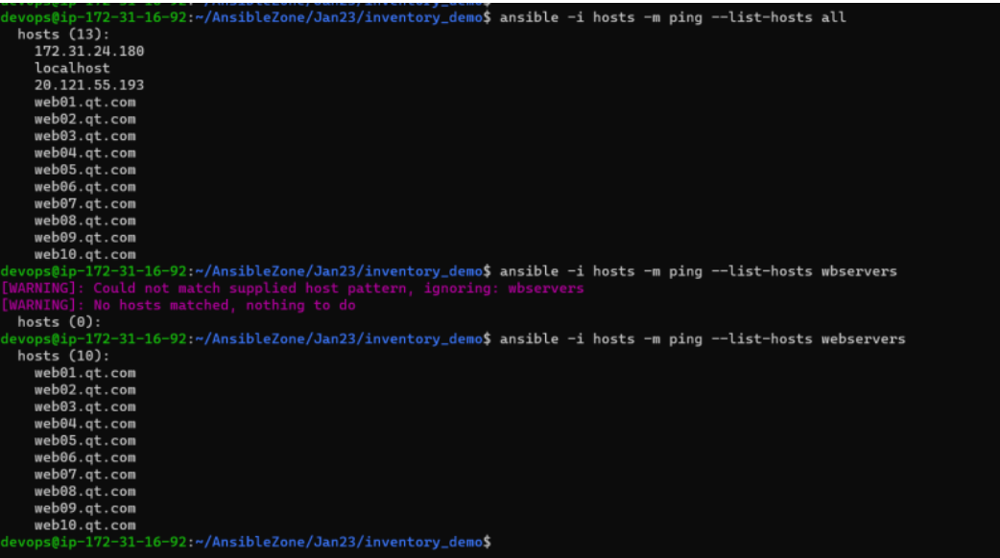

## Inventory

* Ansible allows groups in inventory.
* Inventory is list of hosts where the playbook has to be executed.
* Inventory can be written in two formats
       * ini file
       * yaml 

## Ansible inventory ini file format
 
* ini (initialize file format) file is a text file
* The inventory can be written as follows
* all entries directly 

```
  172.31.24.180
  172.31.24.181
  dev.internal.qt.com

```
* This falls under category all
* We can add specific groups
  
```
172.31.24.180
localhost

[ubuntu]
172.31.24.180
localhost

[centos]
20.121.55.193

```

* In the above file we have two named groups ubuntu and centos and one group all
* If we have sequence of entries we can mention them in inventory

```
172.31.24.180
localhost

[ubuntu]
172.31.24.180
localhost

[centos]
20.121.55.193

[webservers]
web[01:10].qt.com

```

* 
* Adding variables to hosts in inventory
  
```
172.31.24.180
localhost

[ubuntu]
172.31.24.180 name=node1
localhost name=acn

[centos]
20.121.55.193 name=node2

[webservers]
web[01:10].qt.com

```

* let print the variable values using playbook

```
---
- name: test inventory
  hosts: ubuntu
  tasks:
    - name: print my variable
      ansible.builtin.debug:
        var: name

```

* for the changes and see below for execution report : https://github.com/asquarezone/AnsibleZone/commit/7e1755b646a4212add577514499560b8861e2952
*  adhoc commamnds runs one ansible module 
  
