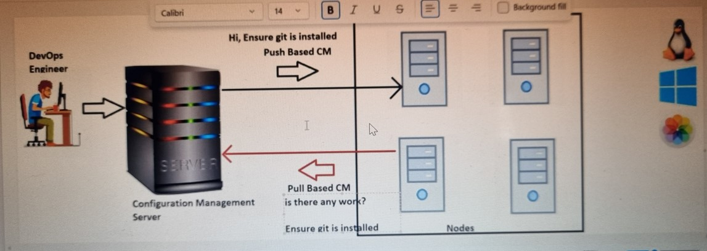
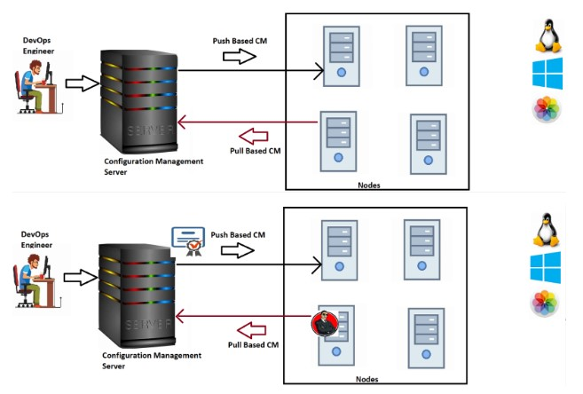
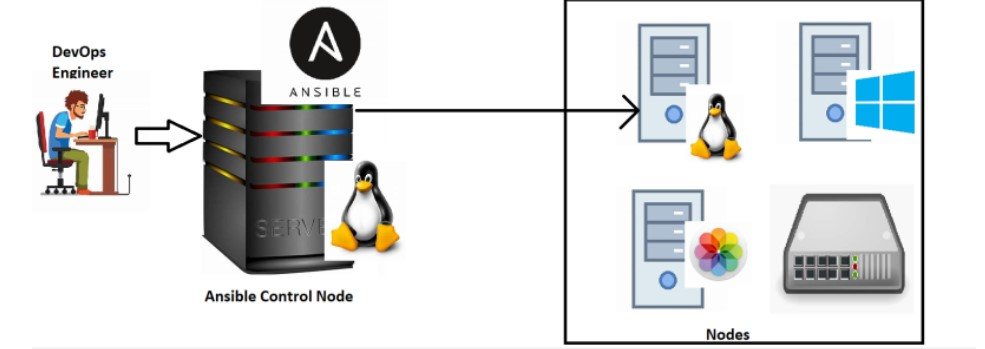

##                                27

# Ansible                      
## Need for Ansible
* Problem Statement
* Organization QA Policy: 
* For every change submitted by developer run
* unit tests (UT)
* functional tests (FT)
* Performacne tests (PT)
* 
  
* For FT and PT we need application to be up and running
* Since number of changes occuring in code will be more we need to do more deployments and doing this manually is not sensible (increases time to market.)
* To Solve this number of deployments we have to automate. To automate we have two ways
  
*                               1) Procedural 
*                               * we can consider Procedural is a Freshers
*                               2) Declarative
*                               * we can consider Declarative is a Experiance person
*                       
*  ## Experience :- Ensure Git to be installed 
*  ## Fresher    :- Update the package and install git 
*  `sudo apt update`
*  `sudo apt install git -y`    or   `scripting`
*                        
* 
* 
* 
* Configuration Management can be acheived by many tools. Some of them are
* Puppet
* Chef
* Ansible
* Salt
* Powershell DSC 
* ## Architecture of Configuration Management (CM)
* Components of Configuration Management Architecture 
  
* CM Server:
* This has necessary tools to automate the deployment
* This server understands the desired state.

* Nodes: 
* These are the servers on which your applications run
* This is where we are supposed to deploy the application 
  
* Types of CM
  
* Pull Based CM:
  
* Nodes need to know about server which requires agent to be installed on the nodes.
      Examples:
                * Chef
                * Puppet
             
* Push Based CM
  
* CM Server should be aware of the nodes
* Server logs in to the node and executes the work
* credentials and permissions are required.
     Examples
                * Ansible
                * Salt

* ## Ansible Specifics 
* 
  
* Ansible is an open source software developed in python.
* Ansible expects python to be installed on nodes.

--------------------------------------------------------------------------

